# Carbon Accounting Platforms
## Architecture overview

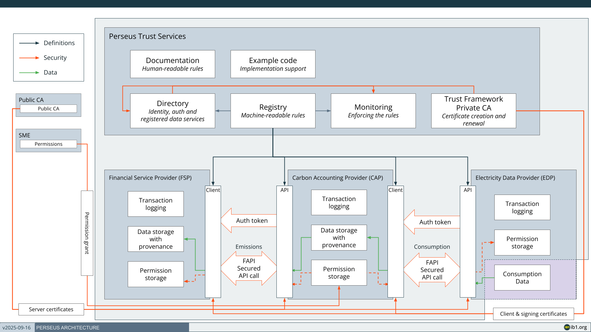

## Demo web applications
Icebreaker One has published demonstration energy data provider (EDP) and carbon accounting provider (CAP) implementations in Python. Our intention is for the code and README there to be self-describing. Please use the GitHub Issues feature on the repository if you have any questions or encounter problems.

[https://github.com/icebreakerone/perseus-demo-energy](https://github.com/icebreakerone/perseus-demo-energy)
[https://github.com/icebreakerone/perseus-demo-cap](https://github.com/icebreakerone/perseus-demo-cap)

## Generate certificates

When your organization completes the Core Trust Framework agreement (see [Legal](legal-and-operational.md)) IB1 will create an organization record in the Sandbox and Production member portals, and invite your administrative contacts to create user accounts on them.

IB1 or your own organisation administrator will send an invitation to create an account on the **Sandbox** member portal at [https://member.core.sandbox.trust.ib1.org](https://member.core.sandbox.trust.ib1.org)

You will need to set a password and provide a 2nd method of authentication via text message or authenticator application.

Once configured, log into the member portal and navigate to the Perseus scheme.

If you have not already done so, create a new Application within the Perseus scheme.

You may choose the application name, but ensure it is clear and recognisable to external audiences, as it will appear publicly in the Directory and on issued certificates.

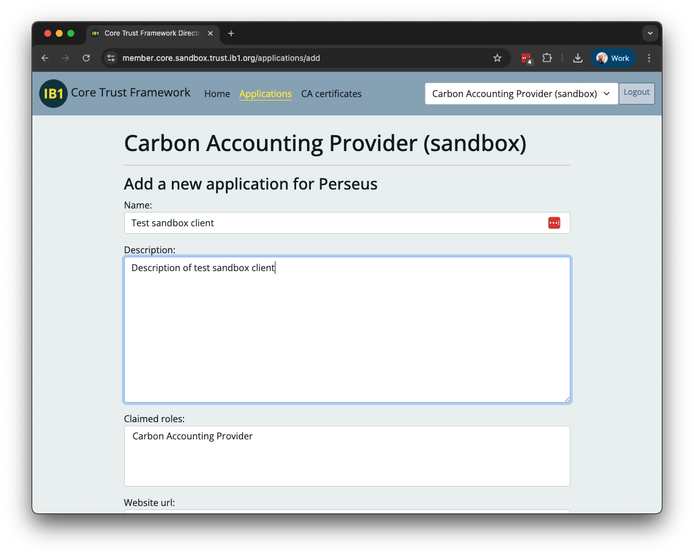

Create a **Client certificate** and a **Signing certificate**. For each, follow the instructions in the Directory to create a CSR with openssl and upload it for signing to the Directory.

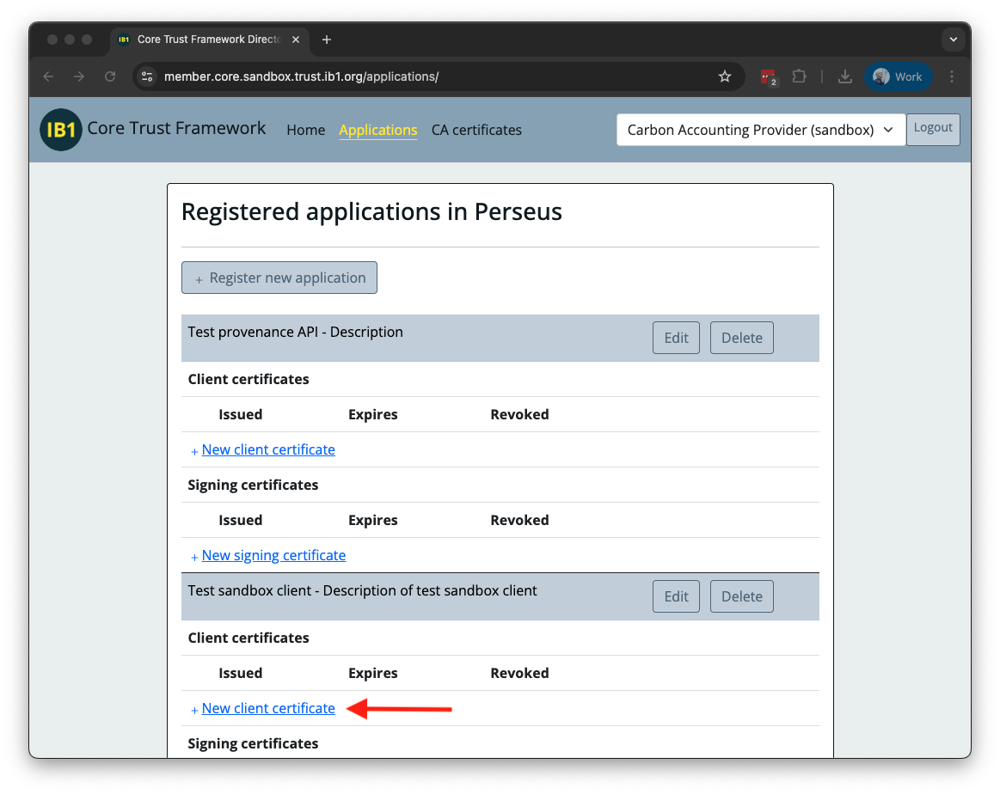
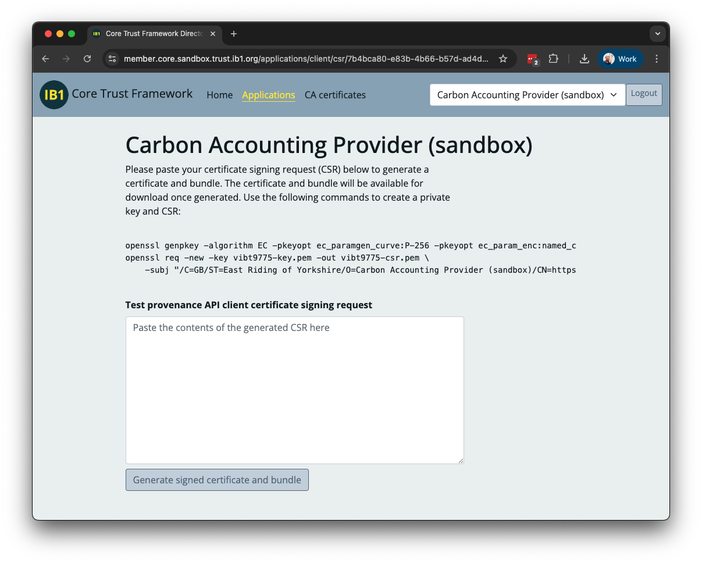

Use a separate private key for each certificate, and store them securely.

Detailed documentation of Perseus certificates may be found in the[Member Identity Digital Certificates](https://specification.docs.ib1.org/member-identity-digital-certificates/1.0/) specification.

## Identifiers
The Trust Framework uses Registry URLs as identifiers to discover APIs and other Members in the Directory. These URLs will vary between environments, both the hostname in the URL and any version number in the URL path.

**Sandbox**

* Registry hostname: `https://registry.core.sandbox.trust.ib1.org`
* Directory hostname: `https://directory.core.sandbox.trust.ib1.org`

**Production**

* Registry hostname: `https://registry.core.trust.ib1.org`
* Directory hostname: `https://directory.core.trust.ib1.org`

You should write your application with a configuration that allows the entire URL to be varied between environments.

## Permission flow

Sequence diagrams for the user permission flows and technical details of the FAPI2 OAuth2 flow are available at 

[https://github.com/icebreakerone/perseus-sequence-diagrams](https://github.com/icebreakerone/perseus-sequence-diagrams)

You must implement at least one of the following permission flows:
* FSP-initiated with one permission
* CAP-initiated with separate permissions

### 1. FSP-initiated with one permission

User start link

#### Landing page (public)

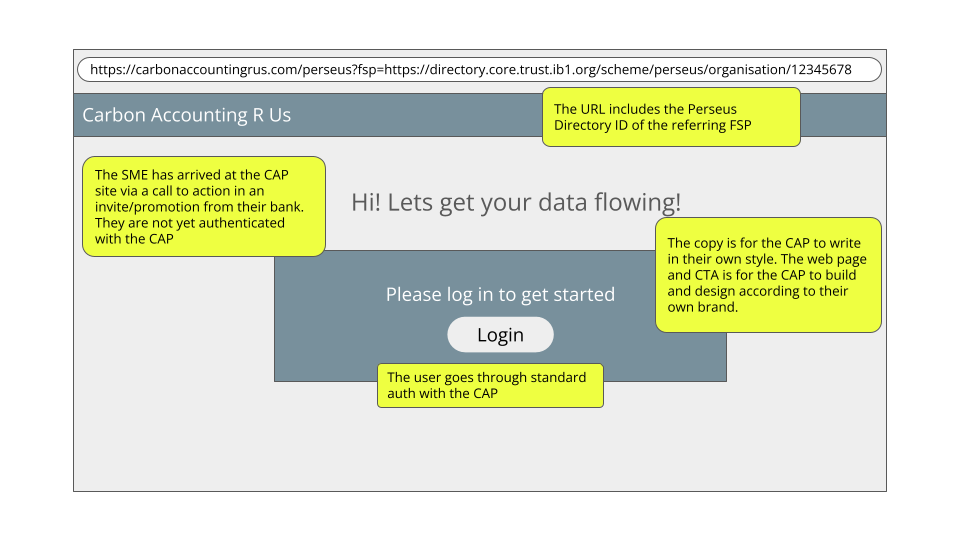

Develop a publicly accessible page that provides users with a concise overview of the service and clear procedural instructions. This page must not require authentication and should focus on informing the user about the process and intended outcomes prior to the collection or processing of any data.

Include buttons to create a new account, or log in if the user already has an account. It is expected that most users will need to create a new account.

The landing page may accept an optional query parameter containing the Financial Service Provider’s (FSP) Directory Member URL, the format of which is specific to your application. This parameter may be used to pre-select the FSP during all subsequent interactions. It should be stored in your database so it can be used in future user sessions.


#### Intro page (logged-in user)
You may wish to create a Perseus-specific page after login to introduce the permissioning process:

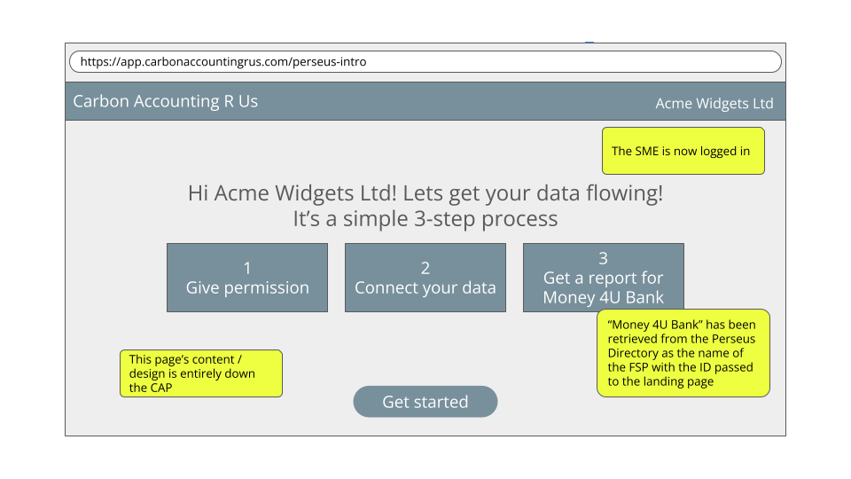

#### Permission screen
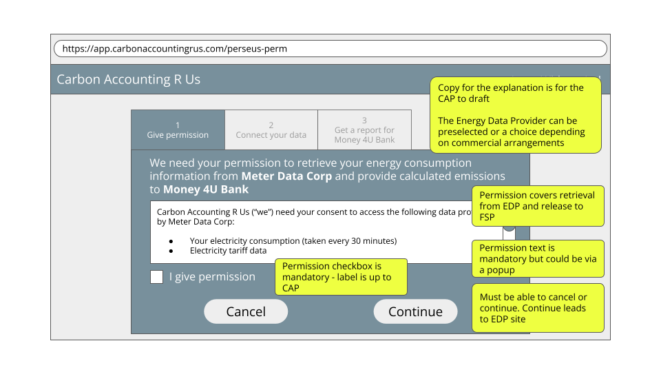

One permission screen is required that includes permission to fetch and process the SME’s energy consumption data from an EDP, and permission to release the data to the named Financial Service Provider (FSP).

The display of permission text is governed by a Perseus Policy, available in the registry.
[https://registry.core.trust.ib1.org/scheme/perseus/policy/data-license-terms/2026-03-12](https://registry.core.trust.ib1.org/scheme/perseus/policy/data-license-terms/2026-03-12)

The permission screen must be displayed before connecting with the Energy Data Provider (EDP). The user must be presented with the Perseus permission text and offered a clear way to agree to it (for example a checkbox). The permission text forms part of the definition of the licence to process the consumption data defined in the Perseus Registry:
[https://registry.core.trust.ib1.org/scheme/perseus/license/energy-consumption-emissions-edp-cap-fsp/2026-03-12](https://registry.core.trust.ib1.org/scheme/perseus/license/energy-consumption-emissions-edp-cap-fsp/2026-03-12) (see permissionText field) 

The permission text contains placeholders for the names of the EDP, CAP (you) and FSP. These should be replaced with either the brand.name field (if specified) or the legalName field (always provided) from the Directory information at each organization's ID e.g. [https://directory.core.sandbox.trust.ib1.org/m/7a1qv915](https://directory.core.sandbox.trust.ib1.org/m/7a1qv915) is the sandbox EDP name

Any other UX for the screen is for you to design.

The subsequent steps to retrieve the data are below this permissions section.

### 2. CAP-initiated with two permissions

This permission allows the CAP to connect to an EDP to retrieve consumption information in advance of knowing which FSP(s) the emissions data reports will be generated for.

#### User start screen

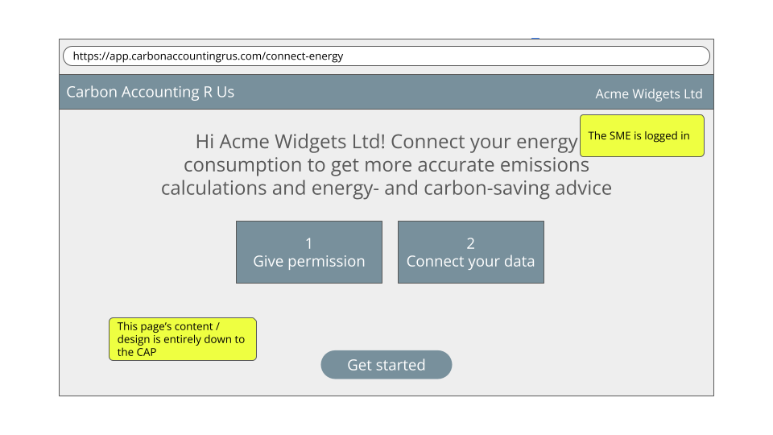


Develop a screen describing the service the SME will receive from you if they connect their consumption data. The UX of this screen is for you to design.


#### EDP Permission UI


This permission includes permission to fetch and process the SME’s energy consumption data from an EDP and to use it to provide advice to the SME.

The display of permission text is governed by a Perseus Policy, available in the registry.
[https://registry.core.trust.ib1.org/scheme/perseus/policy/data-license-terms/2026-03-12 ](https://registry.core.trust.ib1.org/scheme/perseus/policy/data-license-terms/2026-03-12)

The permission screen must be displayed before connecting with the Energy Data Provider (EDP). The user must be presented with the Perseus permission text and offered a clear way to agree to it (for example a checkbox). The permission text forms part of the definition of the licence to process the consumption data defined in the Perseus Registry:
[https://registry.core.trust.ib1.org/scheme/perseus/license/energy-consumption-edp-cap/2026-03-12](https://registry.core.trust.ib1.org/scheme/perseus/license/energy-consumption-edp-cap/2026-03-12) (see permissionText field) 

The permission text contains placeholders for the names of the EDP and CAP (you). These should be replaced with either the brand.name field (if specified) or the legalName field (always provided) from the Directory information at each organization's ID e.g. [https://directory.core.sandbox.trust.ib1.org/m/7a1qv915](https://directory.core.sandbox.trust.ib1.org/m/7a1qv915) is the sandbox EDP name

Any other UX for the screen is for you to design.

The subsequent steps to retrieve the data are below this permissions section.

#### FSP Offer UI

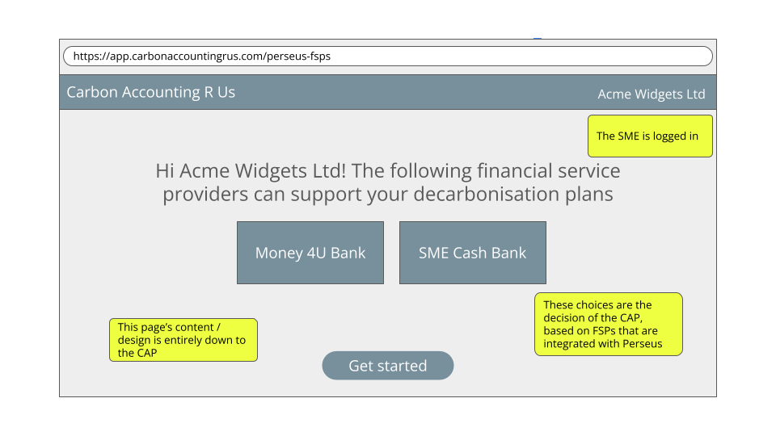

Design a screen allowing a user to select an FSP to create an emissions report for. This screen must only be available if the user already has the earlier permission to retrieve energy data from an EDP.


#### FSP Permission UI

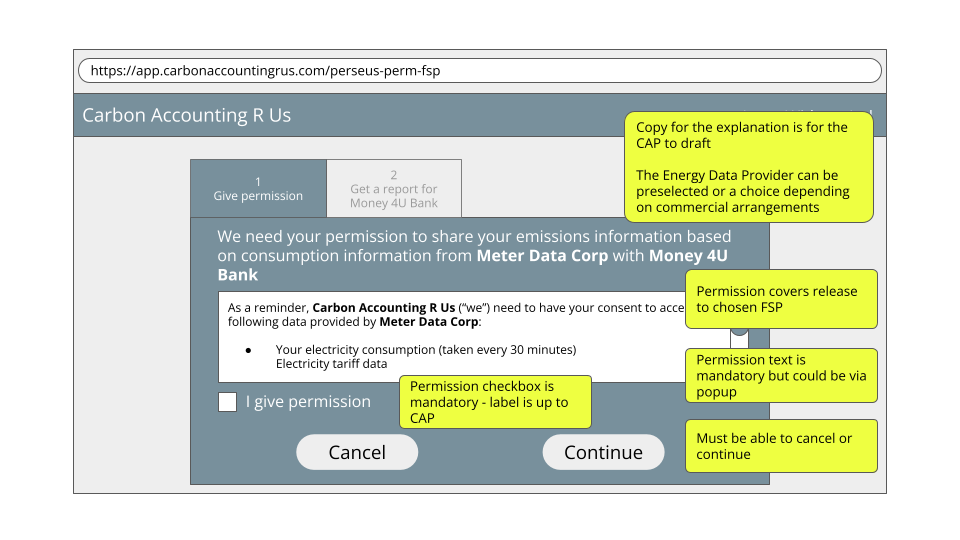


This permission enables the CAP to provide the SME’s calculated emissions data, based on the consumption data from the EDP, to the named FSP.

The display of permission text is governed by a Perseus Policy, available in the registry.
[https://registry.core.trust.ib1.org/scheme/perseus/policy/data-license-terms/2026-03-12](https://registry.core.trust.ib1.org/scheme/perseus/policy/data-license-terms/2026-03-12)
 
The permission screen must be displayed before connecting with the Energy Data Provider (EDP). The user must be presented with the Perseus permission text and offered a clear way to agree to it (for example a checkbox). The permission text forms part of the definition of the licence to process the consumption data defined in the Perseus Registry:
[https://registry.core.trust.ib1.org/scheme/perseus/license/emissions-cap-fsp/2026-03-12](https://registry.core.trust.ib1.org/scheme/perseus/license/emissions-cap-fsp/2026-03-12) (see permissionText field)

The permission text contains placeholders for the names of the EDP, CAP (you) and FSP. These should be replaced with either the brand.name field (if specified) or the legalName field (always provided) from the Directory information at each organizations ID e.g. [https://directory.core.sandbox.trust.ib1.org/m/7a1qv915](https://directory.core.sandbox.trust.ib1.org/m/7a1qv915) is the sandbox EDP name

Any other UX for the screen is for you to design.

The subsequent steps to retrieve the data are below.

### Additional Permission UI - EDP
The user must be offered the ability to add additional meters by repeating the EDP connection process. When multiple meters are connected, the consumption data must be summed and presented in a single report to the FSP.

### Additional Permission UI - FSP
The user may be offered the ability to generate additional reports by repeating the FSP selection and permission process. 

## Log permission

Following the user’s consent in either of the permission dialogs, the system must securely record evidence of the granted permission. Perseus does not define the format or storage requirements for this information, but at a minimum, the stored record must include:

* Timestamp
* Logged in user
* IP address
* User Agent
* Registry URL of the Data License


## Configure API client for Perseus and FAPI

Your API client must:
be able to connect to servers which follow the FAPI 2 specification,
present the client certificate issued to you by the Sandbox Core Trust Framework Directory.

Servers providing machine-to-machine APIs are configured using modern cryptography to meet the [Baseline TLS Configuration](https://specification.docs.ib1.org/baseline-tls-configuration/1.0/) specification. Any recent TLS implementation will be able to connect with default options. 

Ensure certificate validation has not been disabled. Example code for this can be found in `lib/auth.ts` in the [demo CAP code](https://github.com/icebreakerone/perseus-demo-cap).

## OAuth client for consumption data API

Implement the client side of the [OAuth with Member Identity Certificates](https://specification.docs.ib1.org/oauth-with-member-identity-certificates/1.0/) flow.

The key points of the OAuth flow are:
* the use of RFC9126 Pushed Authorization Request (PAR),
* the mTLS client certificate to identify the client rather than a client_id, and
* use of response_type=code & swapping the code for refresh and access tokens after authentication.

The Sandbox provides an implementation of the API, details below, and other Members of the Sandbox may provide EDP implementations you might use which you can discover by querying the Directory’s data service catalog for APIs that conformTo the energy consumption data standard:

[https://directory.core.sandbox.trust.ib1.org/query/data-services?conformsTo=https://registry.core.sandbox.trust.ib1.org/scheme/perseus/standard/energy-consumption-data/2026-03-12](https://directory.core.sandbox.trust.ib1.org/query/data-services?conformsTo=https://registry.core.sandbox.trust.ib1.org/scheme/perseus/standard/energy-consumption-data/2026-03-12)

**Sandbox EDP**
Note endpointURL and oauthIssuer URLs

```
{
 "title":"EDP Sandbox synthetic data",
 "publisher":"https://members.core.sandbox.trust.ib1.org/m/7a1qv915",
 "conformsTo":"https://registry.core.sandbox.trust.ib1.org/scheme/perseus/standard/energy-consumption-data/2026-03-12",
 "endpointURL":"https://perseus-demo-energy.ib1.org/consumption/datasources/",
 "oauthIssuer":"https://perseus-demo-authentication.ib1.org/"
}
```

You may fetch the RFC8414 Authorisation Server Metadata for your chosen EDP manually and hard code the details if this is easier.

Starting the OAuth flow with the PAR is your assertion to the EDP that you have obtained permission from the end user using the standard legal text.


## Retrieve consumption data and grid intensity

### EDP identity confirmation

This UI is presented by the EDP as part of the OAuth flow

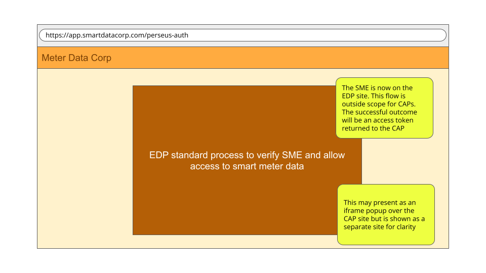

### Consumption data fetch

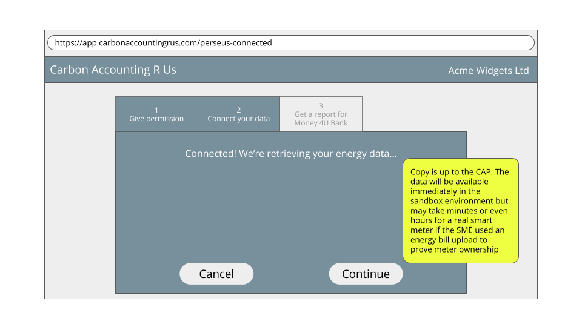

Implement API clients to fetch the raw data:
* Consumption data API](https://registry.core.trust.ib1.org/scheme/perseus/standard/energy-consumption-data/2026-03-12), using the OAuth token. The response includes the meter’s postcode outcode (first half of the postcode).
* Use NESO’s [grid intensity API](https://carbon-intensity.github.io/api-definitions/#get-regional-intensity-from-to-postcode-postcode) to retrieve emissions data using the postcode outcode.

**Note**
In production, your implementation and UI must take into account that consumption data availability may not be immediate. Delays with SmartDCC and manual processes mean that data may take up to 48 hours to become available. Sandbox data is available immediately unless you specifically configure the environment to return an unavailable response.

## Update and store Provenance records from EDP

[Provenance Records](https://specification.trust.ib1.org/provenance-records/1.0/) are a series of “steps” which describe where data came from and how it has been processed. Each participant signs the record with their signing certificate, issued by the Directory. Steps may include assurance metadata, in this case, whether consumption data is from a meter or it has been estimated.

Because of the signatures, Provenance records are a complex format with JWS signatures and base64 encoded JSON data. A [Python reference library](https://github.com/icebreakerone/provenance) is available to generate and update Provenance records, and example code to update the Provenance Records for Perseus is available at [https://github.com/icebreakerone/provenance/tree/perseus-scripts/perseus-scripts](https://github.com/icebreakerone/provenance/tree/perseus-scripts/perseus-scripts). This can be used directly in Python applications, or in an external process.

The steps added are simple data structures. You will be able to hard code most of the values, and the variable data is easy to obtain identifiers and timestamps.


Your implementation must manage the Provenance record:

At the time of retrieving energy consumption data
* Receive Provenance record alongside the consumption data from the EDP.
* Verify signatures on Provenance received record.
* Add a “Receipt” step to acknowledge receipt of consumption data.
* Sign the Provenance record.

At the time of retrieving grid intensity data:
* Add an “external Receipt” to record bringing grid intensity data into the Trust Framework.
* Sign the Provenance record.

At the time of processing/generating the emissions report:
* Add a Processing step for generating the report.
* Sign the complete record.
* Store the Provenance record in logs and database for later.

When transferring the data to another participant, via an API or in a generated document, your implementation must:
* Add a “Transfer” step to the record with the ID of the next participant.
* Sign the complete record.
* Store the Provenance record and pass to the next participant

## Calculate emissions

### Electricity emissions methodology
The sum of the products of the half-hourly consumption and the corresponding grid intensity at the meter postcode. This is the only calculation permitted by Perseus, defined at 
[https://registry.core.trust.ib1.org/scheme/perseus/process/electricity-emissions-calculation/2026-03-12](https://registry.core.trust.ib1.org/scheme/perseus/process/electricity-emissions-calculation/2026-03-12)

Detailed process:

1. Retrieve half-hourly electricity consumption from the Energy Data Provider (EDP) in kWh. This may have been recorded directly by a smart meter, or in the case of partial occupancy it may come via a building management system from a sub-meter or a calculation based on number of occupiers or floorspace.
2. Pull the corresponding half-hourly grid emissions for the first part of the meter address postcode (the "outcode", which is also provided by the EDP) from carbonintensity.org.uk.  Specifically [https://carbon-intensity.github.io/api-definitions/#get-regional-intensity-from-to-postcode-postcode](https://carbon-intensity.github.io/api-definitions/#get-regional-intensity-from-to-postcode-postcode) (kgCO2eq/kWh)
3. Multiply the half-hourly electricity consumption by the half-hourly grid intensity to get electricity consumption half-hourly emissions (kgCO2eq)
4. Produce a report of monthly emissions to an FSP of the SME's choice by summing half-hourly emissions for whole months where data is available. For example if data is available from 2025-05-15 to 2026-03-26, provide monthly data for 2025-06-01 to 2026-02-28. Example report here

More details on the background to the methodology can be found in [section 4 of the appendices](https://ib1.org/wp-content/uploads/2024/12/IB1-PERSEUS-2024-APPENDIX-v2024-12-16.pdf) to the [Perseus 2024 report](https://ib1.org/perseus/2024-report/).


### Gas emissions methodology
The sum of the products of the half-hourly consumption in cubic meters and the most recent published greenhouse gas conversion factor for natural gas covering the time of consumption. This is the only calculation permitted by Perseus, defined at 
[https://registry.core.trust.ib1.org/scheme/perseus/process/gas-emissions-calculation/2026-03-12](https://registry.core.trust.ib1.org/scheme/perseus/process/gas-emissions-calculation/2026-03-12)

Detailed process:
1. Retrieve half-hourly gas consumption from the Energy Data Provider (m3). This may have been recorded directly by a smart meter, or in the case of partial occupancy it may come via a building management system from a sub-meter or a calculation based on number of occupiers or floorspace.
2. Retrieve the most recent Natural Gas emissions intensity figure covering the consumption period from [Defra](https://www.gov.uk/government/publications/greenhouse-gas-reporting-conversion-factors-2024) (kgCO2eq / m3). This is updated annually and there is no API for it.
3. Multiply the half-hourly gas consumption by the gas emissions intensity to get gas consumption half-hourly emissions (kgCO2eq)
4. Produce a report of monthly emissions to an FSP of the SME's choice for whole months where data is available. For example if data is available from 2025-05-15 to 2026-03-26, provide monthly data for 2025-06-01 to 2026-02-28. Example report including electricity and gas [here](../../assets/perseus-example-CAP-SME-carbon-emissions-report-v20260312.pdf)

There is a [discussion paper](https://ib1.org/wp-content/uploads/2026/02/report_-Perseus-Gas-methodology-and-technical-specification-2025-10-15-shared.pdf) covering the gas methodology in the [Perseus 2025 Report accompanying documents](https://ib1.org/perseus/2025-report/).

## Generate report

The initial report must contain data for the last 12 completed calendar months, if available.

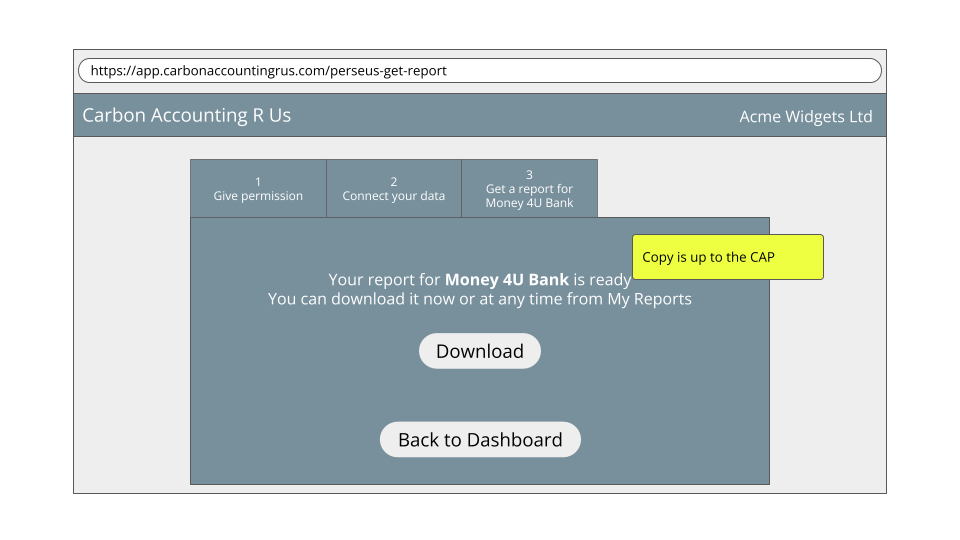

Reports must be generated specifically for the FSP chosen by the user (either via the original link from the FSP, or via their second permission. If the user wishes to share with additional FSPs, permission must be obtained in each case.

The report may be presented as an HTML page or a signed PDF for the user to download. Either is acceptable to demonstrate Perseus-readiness.

Both reports should display the information provided in the [Example Perseus Report](../../assets/perseus-example-CAP-SME-carbon-emissions-report-v20260312.pdf), summarised as:

* Identifying information for your organization (name and ID)
* Identifying information for the SME (name and ID)
* Identifying information for the FSP the report is to be shared with
* Confirmation that the report used the required Perseus method for emissions calculation
* Monthly and total emissions due to gas and/or electricity consumption for the period required (usually the past year)
  * Note that emissions should be reported in complete months only. For example a report generated on 15th July 2025 would run from July 1 2024 to Jun 30 2025 
* Summary and details of the provenance for the data behind the report

### Signed PDF
The PDF should contain:

* human readable report as normal PDF text.
* file attachment of the data used to generate the human readable report, in the same format as returned from APIs.
* file attachment of provenance record,  with a Transfer step using the Bank’s identifier.
* Perseus logo and “this PDF contains assured data” text.
* name of recipient bank and instructions for sending it to them
* PDF digital signature using your Perseus signing certificate

## Withdrawal of Permission

Implement [Withdrawal of Permission](https://specification.trust.ib1.org/withdrawal-of-permission/1.0/):

1) Create a UI to display all the permissions for the logged-in user:

* Permission granted within the CAP
    * Permission to process consumption data
    * Provide report to FSP (potentially multiple FSPs)
* Permission granted at other members (as OAuth tokens)
    * Fetch consumption data from EDPs

For permission granted at the CAP, display the logged details as evidence of the grant of permission.

For permissions granted at other members, use the OAuth token to fetch the [Permission Record](https://specification.docs.ib1.org/permission-records/1.0/) and embed the Evidence URL in an iframe.

2) Implement a [Message Delivery](https://specification.trust.ib1.org/message-delivery-to-applications/1.0/) endpoint, and when a withdrawal message is received from the EDP, remove all other permissions and delete unprocessed data.

3) Implement Withdraw Permission buttons, on each of the permissions, which have slightly different actions:

* Permission to process consumption data
    * Send an RFC7009 revocation to all the EDPs
    * Remove all other permissions, including EDP OAuth Tokens and Reporting to FSPs
    * Delete raw data received from all EDPs.
* Report to FSP
    * Remove this permission only.
* EDP OAuth token (individual EDP)
    * Send an RFC7009 revocation to the EDP
    * Delete raw data received from this EDP.
    * Remove this permission only. (CAP will require it to be reestablished if any further data is needed.)

Withdrawal of permission does not require you to delete any derived data, so if your application has calculated monthly emissions or created other derived data as permitted by the data license, it may retain that derived data.

# Beyond “Perseus-Ready” - considerations for production
## Allow user to choose an EDP where a commercial relationship isn’t required

Some EDPs may not require a commercial relationship with CAPs to provide energy data. As an example, we expect this to be the case for many building management systems. 

In this case, the choice flow for your users should be:

* "I have a smart meter" -> auto-choose the EDP you have an agreement with (or for sandbox, auto-choose the sandbox one)
* "I use a building management system or similar" -> present a choice of EDPs who signal they provide a service at no additional charge (to the SME) e.g. Demand Logic
* "Neither" - sorry, Perseus isn't available for you yet

At the time of writing there isn’t a way to differentiate the two types of EDP in Perseus. We're proposing new role attributes to enable this, and will work this through early 2026. In the meantime the suggestion is to display a choice of all EDPs, since there are no business arrangements in the sandbox.

## Implement transaction logging

Log all interactions with peers to meet auditing requirements. Data must be retained according to the Perseus [Data Retention Policy](https://registry.core.trust.ib1.org/scheme/perseus/policy/data-retention/2026-03-12).

## Implement server allowlist

To ensure that connections are made only to servers operated by Members of the Trust Framework, the Directory maintains an authoritative allowlist of DNS names. This allowlist is published at a stable, Directory-hosted URL, and must be checked before connecting to an API server.

[https://specification.trust.ib1.org/public-ca-issued-server-tls-certificates-with-directory-allowlist/1.0/#allowlist](https://specification.trust.ib1.org/public-ca-issued-server-tls-certificates-with-directory-allowlist/1.0/#allowlist)

## Implement retry logic for consumption data

While test implementations of EDPs will return data immediately, there will be a delay of up to 48 hours before real EDPs are able to return Smart Meter data. During this time, they will return a [202 response](https://registry.core.trust.ib1.org/openapi-viewer/api.html?a=/scheme/perseus/api/consumption-data@2026-03-12.json#/Consumption/getConsumptionData). 

While you can implement and test logic to retry fetching consumption data in the sandbox, you must implement it for the production environment.

## Move to Production environment

To deploy your application in production:
* Wait for your Member record to be created in the Production Directory, after signing the Perseus Agreement.
* Create your Application in the Directory.
* Create Production Client and Signing Certificates
* Configure deployment with Production Identifiers & Certificates

# Future considerations
In the sandbox, there is no need to create any UI to discover EDPs and let the user choose, as all EDPs provide access to the same data. You can choose a single EDP to use, because in production, you will need to make commercial arrangements with an EDP to pay for them to provide Smart Meter data. In future, there may be additional special purpose EDPs which provide access to alternative metering, for example, landlord owned meters for sub-let properties.

While reports are currently documents sent to FSPs by the end user, when automated reporting is implemented, the CAP will need to implement an API and OAuth server for the bank to poll for reports.

A discovery mechanism for CAPs will be implemented by publishing an API to create user start links in the Data Catalog.